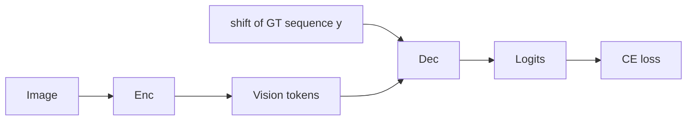
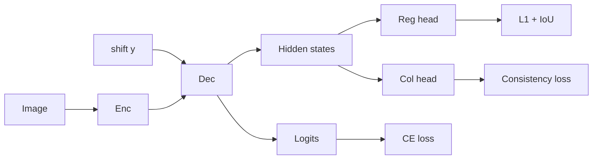
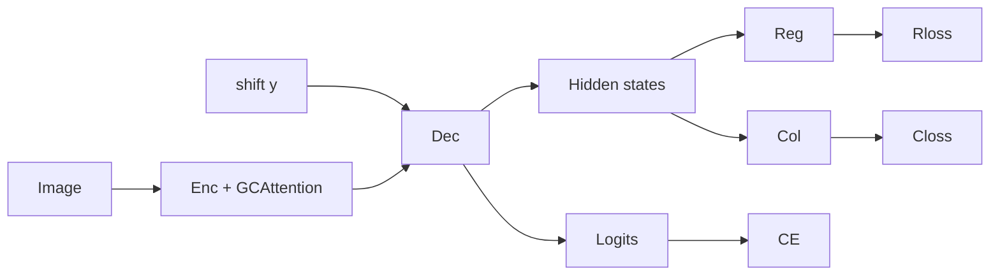
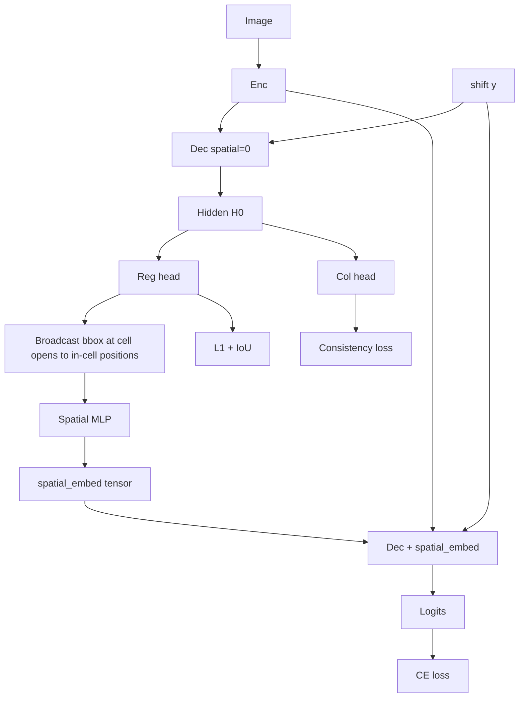
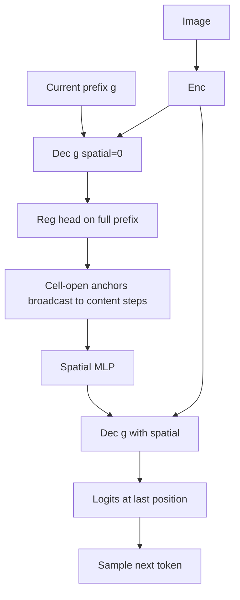

# Technical Report: End-to-End Multi-Task Table Structure Recognition

## 1. Problem Statement

Table Structure Recognition (TSR) aims to recover the logical structure of tables from document images — identifying rows, columns, cells, spanning relationships, and cell content — and producing a machine-readable representation (typically HTML).

Existing approaches suffer from several limitations:

1. **Pipeline fragmentation**: Traditional systems separate table detection, cell detection, structure inference, and OCR into independent stages. Errors propagate and compound across stages.
2. **Spatial imprecision**: Purely generative (token-level) models discretize bounding boxes into a fixed grid, losing sub-pixel accuracy for downstream layout tasks.
3. **Slow autoregressive inference**: Large tables produce long token sequences; sequential decoding becomes a throughput bottleneck.
4. **Lack of global context**: Standard encoder–decoder architectures process local features but miss document-level spatial relationships between distant cells.

This project addresses all four limitations through a two-phase approach: a foundational all-token end-to-end model (Phase 1) followed by targeted precision and efficiency improvements (Phase 2).

## 2. Related Work

### 2.1 Sequence-Based Table Recognition

Recent work frames TSR as image-to-sequence generation. The encoder extracts visual features from a table image; the decoder autoregressively produces an HTML token sequence. This unified paradigm avoids pipeline fragmentation and was popularized by systems such as TableFormer and MTL-TabNet.

### 2.2 Coordinate Discretization

To unify spatial and textual tokens into a single vocabulary, continuous bounding-box coordinates are discretized onto a fixed grid (e.g. 1024 x 1280). Each cell boundary becomes four discrete tokens `<Xmin>v, <Ymin>v, <Xmax>v, <Ymax>v`. This approach enables standard cross-entropy training over the full sequence but sacrifices sub-pixel accuracy.

### 2.3 Hybrid Regression

To recover spatial precision lost by discretization, auxiliary regression heads predict continuous normalized coordinates alongside the discrete token logits. Combined L1 + IoU losses directly optimize spatial overlap.

### 2.4 Parallel Decoding

DREAM-style parallel decoding replaces sequential token generation with a feature aggregator that predicts multiple elements simultaneously, reducing inference time proportional to the parallelism factor.

### 2.5 Global Context Attention

GCAttention (Global Context Attention) augments convolutional or transformer encoders with multi-aspect global context modeling after residual blocks, improving the encoder's ability to capture long-range spatial dependencies.

### 2.6 Evaluation Metrics

TEDS (Tree-Edit-Distance-based Similarity) is the standard metric for TSR evaluation. It compares predicted and ground-truth HTML tables as trees and computes a normalized similarity score between 0 and 1.

## 3. Architecture Design

### 3.1 Overview

The system is an encoder–decoder model that maps a table image to a unified autoregressive sequence:

```
y = {c, b, t, <Sep>}
```

where `c` = cell content (character-level tokens), `b` = bounding-box tokens (discretized spatial coordinates), `t` = structural HTML tags, and `<Sep>` separates cells.

**Loss function:**

```
L = lambda_1 * CE_struc + lambda_2 * CE_cont + lambda_3 * L1_bbox + lambda_4 * IoU + lambda_5 * Consistency
```

### 3.2 Encoder

Three backbone options are provided, trading capacity for memory:

| Backbone | Description | Param Count | Use Case |
|---|---|---|---|
| `swin_b` | Swin Transformer Base | ~88M | High accuracy, large VRAM |
| `resnet31` | ResNet-31 (variable-size input) | ~25M | Balanced (default) |
| `convstem` | Stride-2 3x3 conv stem | ~5M | Extreme memory constraints |

**GCAttention** can be added after residual blocks in any encoder to model global spatial relationships.

### 3.3 Decoder

A Transformer decoder with the following design choices:

- **NoPE (No Positional Encoding)**: Removes explicit 1D positional embeddings; the causal attention mask provides implicit relative positioning.
- **HTML Refiner**: A non-causal attention module between structure and content pathways, allowing cells to share dense structural features and improving structure consistency.
- **DREAM Parallel Decoder** (optional): Uses N element queries to generate sequences for multiple cells simultaneously.

### 3.4 Coordinate Discretization

All bounding-box coordinates are scaled to a fixed grid:

- Grid width: 1024
- Grid height: 1280

Each cell boundary is represented as four tokens: `<Xmin>v`, `<Ymin>v`, `<Xmax>v`, `<Ymax>v` where `v` is the discretized integer coordinate.

### 3.5 Token Compression

An optional pixel-shuffle and compression layer reduces vision token sequence length by up to 20% (`token_compression=0.8`), improving decoder throughput with minimal accuracy impact.

### 3.6 Hybrid Regression Head

An auxiliary linear layer with Sigmoid activation predicts continuous normalized coordinates `(x, y, w, h)` from decoder hidden states, supervised by:

- **L1 loss**: Penalizes coordinate distance.
- **IoU loss**: Directly optimizes bounding-box overlap.
- **Column consistency loss**: Minimizes prediction variance across tokens in the same logical column.

## 4. Data Pipeline

### 4.1 PubTables-1M Integration

The `Pub1MParser` converts PubTables-1M XML annotations and word-level JSON files into the model's label format. The pipeline handles:

- Cell boundary extraction from XML structure
- Word-level content alignment
- Spanning cell detection via grid analysis (1.3x threshold heuristics for rowspan/colspan)
- Header row identification
- Reading-order sorting

### 4.2 Dataset Format

**Simplified format** (recommended): A JSON file listing `[image_path, label_path]` pairs.

```json
[
  ["/path/to/image1.jpg", "/path/to/label1.json"],
  ["/path/to/image2.jpg", "/path/to/label2.json"]
]
```

**Legacy format**: A directory of per-sample JSON files, each containing `image_path` and `table` structure.

### 4.3 Vocabulary

The vocabulary is built deterministically from:

1. Special tokens: `<Pad>`, `<BOS>`, `<EOS>`, `<Sep>`, structural HTML tags
2. Coordinate tokens: `<Xmin>0` .. `<Xmin>1023`, `<Ymin>0` .. `<Ymin>1279`, etc.
3. ASCII printable characters (code points 32–126)
4. Common Latin-extended Unicode characters
5. Any additional characters discovered in the training data

The vocabulary can be exported from a trained checkpoint (`export_vocab.py`) and reused across datasets to ensure consistent token-to-id mappings.

### 4.4 Caching

`TableDataset` caches preprocessed sequences (token ids, masks, bboxes) to disk on first load. Subsequent loads skip serialization and vocabulary construction, reducing startup time from minutes to seconds for large datasets.

## 5. Experiment Setup

### 5.1 Phase 1: Foundation Baseline

**Foundation_Basic** establishes the baseline with the core all-token paradigm:

- Unified sequence serialization `y = {c, b, t, <Sep>}`
- Right-shifted input tokens for teacher-forced training
- Unified cross-entropy loss over all token types
- ResNet-31 encoder, 3-layer Transformer decoder

| Hyperparameter | Value |
|---|---|
| `encoder_backbone` | `resnet31` |
| `embed_dim` | 384 |
| `decoder_layers` | 3 |
| `decoder_heads` | 6 |
| `ffn_dim` | 1536 |
| `image_size` | (512, 640) |
| `batch_size` | 1–4 (GPU dependent) |
| `gradient_accumulation_steps` | 8 / batch_size |
| `learning_rate` | 1e-4 (AdamW) |
| `use_mixed_precision` | True |
| `gradient_checkpointing` | True |

### 5.2 Phase 2: Improvement Experiments

Each experiment adds one improvement to measure its isolated contribution:

| Experiment | Added Feature | Expected Benefit |
|---|---|---|
| `Improvement_HybridRegression` | Auxiliary regression head, L1+IoU+consistency loss | Better bbox accuracy, lower spatial loss |
| `Improvement_HTMLRefiner` | Non-causal structural attention | Better structure consistency |
| `Improvement_GCAttention` | Global context attention in encoder | Better global understanding |
| `Improvement_TokenCompression` | 20% vision token reduction | ~20% faster inference, similar accuracy |
| `Improvement_AllCombined` | All of the above | Cumulative benefits |

Phase 2 experiments use a larger model (embed_dim=512, 4 layers, 8 heads, ffn_dim=2048) to give improvements room to show impact.

### 5.3 Metrics

| Metric | Description | Range |
|---|---|---|
| **TEDS** | Tree-edit-distance similarity between predicted and ground-truth HTML | 0–1 (higher is better) |
| **Token Accuracy** | Fraction of correctly predicted tokens (excluding padding) | 0–100% |
| **Structure Accuracy** | Accuracy on structural tokens only (`<table>`, `<tr>`, `<td>`, ...) | 0–100% |
| **Content Accuracy** | Accuracy on content tokens only (text characters) | 0–100% |
| **Exact Match Rate** | Fraction of sequences matching ground truth exactly | 0–100% |
| **Perplexity** | exp(validation loss) — language-modeling quality | 1+ (lower is better) |
| **Inference Time** | Average forward-pass time per batch | ms |
| **Model Size** | Total parameter count and checkpoint size | MB |

### 5.4 Comparison

After running experiments:

```bash
python experiments/compare_results.py --results_dir ./experiment_results
```

This generates `comparison_report.md` with:
- Side-by-side loss, accuracy, and timing comparisons
- Percentage improvement over the foundation baseline
- Model size trade-off analysis

### 5.5 Model architecture flows (training vs inference)

This subsection documents how data moves through `TableRecognitionModel` for **each experiment script** under `experiments/`. Unless noted, the **decoder** is the sequential `TransformerDecoder` (not the parallel/DREAM path).

**Shared notation**

| Symbol | Meaning |
|--------|---------|
| `Enc` | Visual encoder (backbone varies by experiment) |
| `Dec` | Transformer decoder (NoPE, optional HTML refiner inside) |
| `shift(y)` | Right-shifted teacher input built from ground-truth sequence `y` |
| `CE` | Token cross-entropy (structure + content + coordinate tokens when present) |
| `Reg` | `HybridRegressionHead` on decoder hidden states → normalized `(x,y,w,h)` |
| `Col` | `ColumnConsistencyHead` (used only when hybrid regression is on) |
| `Spatial` | `SpatialConditioningMLP`: per-token bbox `(x,y,w,h)` → embedding added to token embeddings before decoder layers |

**Validation (metrics)** in `base_experiment.validate` uses **teacher forcing**: the same **training** forward is run with `shift(y)` and ground-truth length. **Autoregressive inference** uses `model.generate()` (one step at a time, no future tokens).

---

#### Foundation_Basic (`exp_foundation_basic.py`)

Encoder: `resnet31`. No hybrid regression, no spatial conditioning. Optional `token_compression=0.8` on the encoder in config.

**Training (teacher forcing)**



**Inference (autoregressive)**


---

#### Improvement_HybridRegression (`exp_improvement_hybrid_regression.py`)

Adds `Reg` and `Col` on **the same** decoder hidden states used for logits (single decoder forward). Supervision: L1 + IoU + column consistency against per-token bbox targets from the dataset.

**Training**



**Inference**

Same autoregressive loop as Foundation_Basic; regression heads are optional at decode time (e.g. for tracing boxes), not required to produce the next token.

---

#### Improvement_HTMLRefiner (`exp_improvement_html_refiner.py`)

Same as HybridRegression, plus **HTML refiner** (non-causal self-attention block after decoder layers, before the output projection). Flow topology is unchanged; `Dec` denotes “decoder stack including refiner.”

**Training / inference**

Diagram identical to Improvement_HybridRegression, with the note that `Dec` includes the refiner submodule.

---

#### Improvement_GCAttention (`exp_improvement_gc_attention.py`)

Same as HTMLRefiner experiment config, with **GCAttention** enabled inside `Enc`. Only the encoder path changes.

**Training**



**Inference**

Same as HybridRegression autoregressive loop; encoder still uses GCAttention.

---

#### Improvement_TokenCompression (`exp_improvement_token_compression.py`)

Same as GCAttention experiment, plus **token compression** in the encoder (shorter vision token sequence, ratio e.g. `0.8`).

**Training / inference**

Same graph as Improvement_GCAttention; vision tokens `V` are fewer tokens per image.

---

#### Improvement_SpatialOCR & Improvement_AllCombined (`exp_improvement_spatial_ocr.py`, `exp_improvement_all_combined.py`)

These enable **`coordinate_free`** (no discrete coordinate tokens in the sequence), **`use_hybrid_regression`**, and **`use_spatial_conditioning`**. Cell location is **only** from the regression head; spatial conditioning for content tokens uses **predicted** bboxes, not ground-truth bboxes, so training matches inference.

**Training (two decoder passes per batch)**

1. **Unconditioned pass:** `Dec` with `spatial_embed = 0`, `return_features=True` → hidden states `H₀`.
2. `Reg(H₀)` → per-step bbox predictions; at each `<td>`/`<th>` position the predicted vector is **broadcast** to following in-cell token positions (same layout as dataset `cell_bbox_per_token`, but values from `Reg`).
3. `Spatial` maps those per-token boxes to embeddings.
4. **Conditioned pass:** `Dec` with `spatial_embed` added to token embeddings → **logits** for CE.

Regression and column losses still use **`Reg(H₀)`** (and features aligned with `H₀`), i.e. the same head output used to build spatial layout.



**Inference (autoregressive, each new token)**

For each prefix `g` (generated so far), the implementation runs the **same** two-pass pattern: `Dec(g)` without spatial → `Reg` → build `spatial_embed` from `g` + predicted boxes → `Dec(g)` with spatial → logits for the **next** token only.



`Improvement_AllCombined` is the same spatial two-pass logic, with **HTML refiner**, **GCAttention**, and **token compression** enabled together per its `ExperimentConfig`.

---

#### Optional: mixed TSR + OCR training

`train_mixed.py` uses the same `TableRecognitionModel` forward as the selected `ExperimentConfig`; when spatial conditioning and hybrid regression are on, **`model.set_id_to_token(...)`** must be registered (handled in `run_experiment` for experiment scripts).

## 6. Results and Discussion

*This section should be populated after running the full experiment suite. Template below.*

### 6.1 Foundation Baseline

| Metric | Value |
|---|---|
| Final Train Loss | — |
| Final Val Loss | — |
| Token Accuracy | — |
| Structure Accuracy | — |
| TEDS | — |
| Inference Time (ms/batch) | — |
| Parameters | — |

### 6.2 Improvement Comparison

| Experiment | Val Loss | TEDS | Token Acc | Inference (ms) | Params |
|---|---|---|---|---|---|
| Foundation_Basic | — | — | — | — | — |
| +HybridRegression | — | — | — | — | — |
| +HTMLRefiner | — | — | — | — | — |
| +GCAttention | — | — | — | — | — |
| +TokenCompression | — | — | — | — | — |
| AllCombined | — | — | — | — | — |

### 6.3 Analysis

Key questions to address after experiments:

1. Does hybrid regression meaningfully improve bbox IoU over pure discretization?
2. Does the HTML refiner improve structure accuracy (row/column alignment)?
3. Does GCAttention help on tables with many rows or complex layouts?
4. Does token compression achieve the target ~20% inference speedup without significant accuracy loss?
5. Do improvements compose well, or do diminishing returns appear?

## 7. Memory Optimization

Three configuration profiles are provided for different VRAM budgets:

| Profile | Parameters | Est. VRAM (batch=1, FP16) | Key Settings |
|---|---|---|---|
| **Full** | ~200M | 8–10 GB | swin_b, 768d, 6 layers |
| **Standard** | ~42M | 4–6 GB | resnet31, 512d, 4 layers, FP16, grad accum |
| **Extreme** | ~20–30M | 1.5–2.5 GB | convstem, 384d, 3 layers, checkpointing, token compression, (384,512) images |

All experiment scripts default to the **Standard** or **Extreme** profile. Adjust `embed_dim`, `decoder_layers`, `batch_size`, `image_size`, and `gradient_checkpointing` as needed.

Tips for OOM situations:
- Enable `gradient_checkpointing=True` (~30–40% memory reduction, ~20% slower)
- Reduce `image_size` (e.g. `(384, 512)` or `(256, 384)`)
- Use `encoder_backbone="convstem"` (lightest encoder)
- Lower `embed_dim` to 256 and `decoder_layers` to 2
- Call `torch.cuda.empty_cache()` between epochs

## 8. Checkpoints

### Contents

Each `.pth` checkpoint contains:

```python
{
    "epoch": int,
    "model_state_dict": dict,
    "optimizer_state_dict": dict,
    "config": dict,            # ExperimentConfig
    "vocab": dict,             # {token: id} mapping
    "train_loss": float,
    "val_loss": float,
    "train_losses": list,      # Full history
    "val_losses": list,
    "val_metrics_history": list,
    "best_val_loss": float,
    "best_epoch": int,
}
```

### Save Schedule

- `latest.pth` — every epoch
- `best.pth` — when validation loss improves
- `epoch_{N}.pth` — every 5 epochs and final epoch

### Loading for Inference

```python
import torch
from tsr.models.model import TableRecognitionModel

checkpoint = torch.load("best.pth", map_location="cuda")
model = TableRecognitionModel(vocab_size=len(checkpoint["vocab"]), **checkpoint["config"])
model.load_state_dict(checkpoint["model_state_dict"])
model.eval()
```

## 9. Proposed Experiments (Phase 3)

### 9.1 Coordinate-Free Vocabulary (Location Token Elimination)

**Motivation.** The current vocabulary contains 4,612 discrete coordinate tokens (`<Xmin>0`..`<Xmin>1023`, `<Ymin>0`..`<Ymin>1279`, and likewise for Xmax/Ymax), which account for 63.8% of the 7,226-token vocabulary. When hybrid regression is enabled, the model already predicts continuous bounding-box coordinates `(x, y, w, h)` via a dedicated regression head — making the discrete coordinate tokens redundant.

**Hypothesis.** Removing coordinate tokens from the vocabulary and relying solely on hybrid regression for spatial prediction will:

1. **Reduce vocab size by ~64%** (7,226 → ~2,614), shrinking the decoder's output projection and embedding layers proportionally.
2. **Shorten sequences** — each cell currently emits 4 coordinate tokens (`<Xmin>v <Ymin>v <Xmax>v <Ymax>v`); removing them shortens the sequence by 4 tokens per cell, reducing memory and compute during both training and inference.
3. **Improve spatial accuracy** — the regression head optimizes continuous coordinates directly (L1 + IoU loss), avoiding the quantization error inherent in discretizing to a 1024x1280 grid.
4. **Simplify the loss landscape** — the cross-entropy loss no longer needs to discriminate among thousands of coordinate classes.

**Design.**

Current sequence per cell:
```
<td> <Xmin>v1 <Ymin>v2 <Xmax>v3 <Ymax>v4 H e l l o </td> <Sep>
```

Proposed sequence per cell (coordinate-free):
```
<td> H e l l o </td> <Sep>
```

The hybrid regression head predicts `(x, y, w, h)` from the decoder hidden state at the `<td>`/`<th>` token position. Spatial supervision comes entirely from L1 + IoU + column consistency losses.

**Changes required:**

| Component | Change |
|---|---|
| `SequenceSerializer.serialize_table()` | Add `include_coordinates=False` mode that skips bbox token emission |
| `SequenceSerializer.create_vocabulary()` | Add `include_coordinates=False` mode that omits coordinate tokens |
| `TableDataset` | Pass coordinate mode flag; update mask creation and bbox extraction |
| `ExperimentConfig` | Add `coordinate_free: bool` field |
| New experiment script | `exp_improvement_coord_free.py` |
| Inference | Reconstruct bboxes from regression output instead of parsing coordinate tokens |

**Risk.** The regression head must be accurate enough to replace discrete coordinate tokens entirely. Early training may be unstable without the coordinate token signal to anchor spatial learning. A warmup strategy (train with coordinate tokens first, then remove) could mitigate this.

---

### 9.2 Cell-Location-Conditioned Content Generation with Textlines

**Motivation.** The current decoder generates content tokens (characters) without any explicit spatial conditioning — it relies entirely on the autoregressive context and encoder cross-attention to decide what text to produce. Meanwhile, the hybrid regression head already predicts the cell's bounding box `(x, y, w, h)` from the decoder hidden state at the `<td>`/`<th>` position. This predicted cell location is only used for spatial loss computation and never fed back to help content generation.

The insight: **the regression-predicted cell location tells the model exactly where in the image to look.** Feeding it back into the decoder as a spatial prior for subsequent content tokens would help the model focus its cross-attention on the correct image region, producing more accurate OCR output.

Additionally, cells often contain multiple lines of text. The current representation flattens all content into a single character stream (`H e l l o   W o r l d`), losing the textline structure. Textlines are the natural unit of OCR output and carry their own spatial layout within the cell.

**Hypothesis.** Conditioning content generation on the regression-predicted cell location and structuring content as textlines will:

1. **Improve content accuracy** — the cell bbox embedding acts as a spatial attention prior, guiding the decoder's cross-attention to the correct image region rather than attending over the full encoder output.
2. **Improve multi-line cell handling** — explicit `<LineSep>` tokens between textlines preserve the reading order and vertical structure within cells.
3. **Create a tighter OCR feedback loop** — the regression head's output is not a dead-end; it feeds forward into content generation, giving the spatial prediction a downstream purpose that may also improve regression quality via gradient flow.

**Design.**

The key change is a **spatial conditioning module** that projects the regression-predicted cell bbox into an embedding and adds it to the decoder input for in-cell tokens. **Training and inference use the same signal:** bbox layout is built from **`HybridRegressionHead` outputs** on an **unconditioned** decoder pass, then fed through `SpatialConditioningMLP` into a **second** decoder pass for logits (see **§5.5**, Improvement_SpatialOCR / AllCombined diagrams). Regression quality is enforced by L1/IoU (and related) losses on the same predictions.

1. **Per-step regression**: The regression head produces `(x, y, w, h)` at every sequence position from decoder hidden states (typically supervised at structure-relevant steps via `bbox_mask`).

2. **Broadcast to in-cell tokens**: At each `<td>` / `<th>` open tag, the predicted box at that step is **reused** for all following content tokens until the matching `</td>` / `</th>` (same structural rule as `TableDataset._build_cell_bbox_per_token`).

3. **Injection**: For those positions, `SpatialMLP([x, y, w, h])` → `embed_dim` is **added to the token embedding** before decoder layers on the **conditioned** pass.

4. **Textline structure**: Cell content is organized as textlines separated by `<LineSep>`:
   ```
   <td> L i n e 1 <LineSep> L i n e 2 </td> <Sep>
   ```
   PubTables-1M word data already includes `line_num` per word, so textlines can be reconstructed by grouping words by `line_num`.

**Current vs. proposed sequence:**

Current:
```
<td> <Xmin>v1 <Ymin>v2 <Xmax>v3 <Ymax>v4 H e l l o   W o r l d </td> <Sep>
```

Proposed (with coordinate-free vocab from 9.1):
```
<td> H e l l o <LineSep> W o r l d </td> <Sep>
       ▲                    ▲
       └── both conditioned on cell_spatial_embed from regression head
```

**Changes required:**

| Component | Change |
|---|---|
| `Pub1MParser` | Group words by `line_num` to produce textlines per cell |
| Label JSON format | Cell `content` becomes `"line1\nline2"` (newline-separated textlines) |
| `SequenceSerializer` | Add `<LineSep>` token; serialize content as textlines |
| `TableRecognitionModel` | Add `SpatialMLP` module; route regression output back to content token embeddings |
| `TransformerDecoder` | Accept optional `spatial_embed` per-token; add to token embeddings |
| `TableDataset` | Build cell-to-token mapping so spatial embed is applied to correct positions |
| `ExperimentConfig` | Add `use_spatial_conditioning: bool` field |
| New experiment script | `exp_improvement_spatial_ocr.py` |

**Risk.** During early training the regression head is inaccurate, so the spatial embedding is noisy; the regression losses must carry most of the early spatial learning. Adding `<LineSep>` tokens slightly increases sequence length.

---

### 9.3 Combined: Coordinate-Free + Spatial-Conditioned OCR

The two ideas compose naturally:

- **Remove** discrete coordinate tokens from the sequence (9.1) — rely on hybrid regression for cell bboxes.
- **Feed back** the regression-predicted cell location into content generation (9.2) — spatial conditioning for OCR.
- **Structure** cell content as textlines with `<LineSep>`.

Net effect on sequence:

| Component | Before | After |
|---|---|---|
| Cell bbox | 4 discrete tokens per cell | Regression head (0 tokens) |
| Content | Flat character stream | Textlines with `<LineSep>` |
| Vocab size | ~7,226 | ~2,615 + `<LineSep>` |
| Spatial signal for OCR | None (implicit via cross-attention) | Explicit cell bbox embedding from regression |

This combined approach removes spatial tokens from the vocabulary, shortens sequences, and routes the regression head's output back into content generation — creating a closed loop where spatial prediction directly improves OCR quality.

## 10. References

- Swin Transformer: Liu et al., "Swin Transformer: Hierarchical Vision Transformer using Shifted Windows," ICCV 2021
- PubTables-1M: Smock et al., "PubTables-1M: Towards comprehensive table extraction from unstructured documents," CVPR 2022
- TEDS metric: Zhong et al., "Image-based table recognition: Data, model, and evaluation," ECCV 2020
- DREAM parallel decoding: conceptual framework for multi-element parallel generation
- GCAttention: Global Context Attention for enhanced spatial reasoning in convolutional encoders
- MTL-TabNet: Multi-task learning trigger mechanism for table recognition
